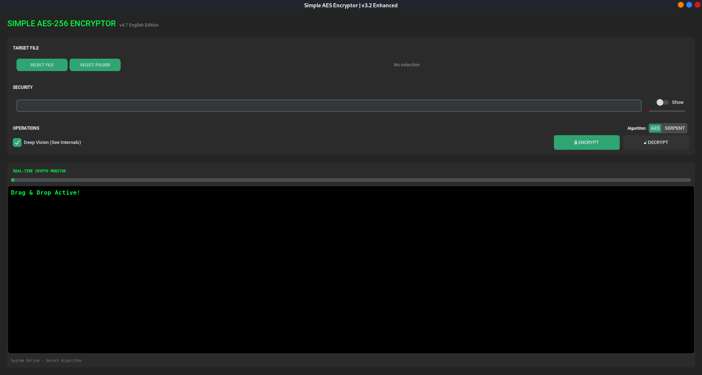
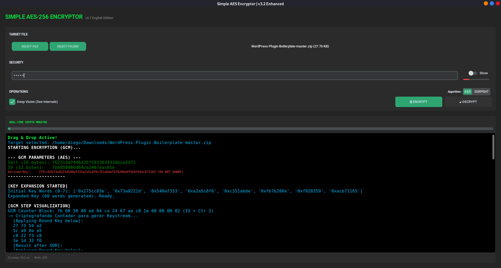

# Simple Encryptor GCM 🔐

<div align="center">

**Simple GUI app for file encryption using AES-256-GCM & Serpent**

[](https://opensource.org/licenses/MIT)
[](https://www.python.org/downloads/)
[](https://www.debian.org/)

[Installation](#-installation) • [Usage](#-usage) • [Features](#-features) • [Documentation](#-documentation)

</div>

---

## 📋 About

**Simple Encryptor GCM** is a GUI application developed in Python to encrypt and decrypt files using **AES-256-GCM** and **Serpent-256**. The key feature is the **real-time education monitor** that visually shows the encryption process step-by-step (e.g. Matrix Mixing, S-Boxes) while maintaining high performance via C extensions.

### ✨ Features

- 🔐 **Multi-Algorithm**: AES-256-GCM (Standard) & Serpent-256 (High Security)
- 🚀 **Turbo Performance**: Custom C backend (`libserpent`) for Serpent acceleration
- 🔑 **PBKDF2**: Key derivation with HMAC-SHA256
- 🎨 **Modern Interface**: CustomTkinter with Dark/Matrix theme
- 👁️ **Deep Vision**: Inspection of internal rounds (AES MixColumns, Serpent S-Boxes)
- 📟 **Real-Time Monitor**: Visual terminal showing the crypto math live via sampling
- 📦 **Debian Package**: Easy installation via `.deb`
- 🎯 **Desktop Integration**: Drag & Drop support, Native File Dialogs
- 🔒 **Authenticated Encryption**: GCM (AES) and CTR+HMAC (Serpent) ensure integrity

## 🚀 Installation

### Method 1: Via .deb Package (Recommended)

```bash
# Install the package
sudo dpkg -i simple-encryptor.deb

# If dependencies are missing:
sudo apt-get install -f
```

### Method 2: Direct Execution

```bash
# Clone the repository
git clone https://github.com/your-username/simple-aes-encryptor.git
cd simple-aes-encryptor

# Install dependencies
sudo apt-get install python3-tk python3-cryptography
pip3 install customtkinter --break-system-packages

# Run
python3 simple-encryptor/usr/bin/simple-encryptor
```

## 💻 Usage

### Launch the Application

**Via Terminal (GUI):**
```bash
simple-encryptor
```

**Via Terminal (CLI Mode):**
```bash
# Encrypt (AES Default)
simple-encryptor-cli -e my_file.txt -p my_password

# Encrypt (Serpent)
simple-encryptor-cli -e my_file.txt -p my_password --algo SERPENT

# Encrypt with Real-Time Visualization (Serpent)
simple-encryptor-cli -e my_file.txt -p my_password --algo SERPENT -v

# Decrypt
simple-encryptor-cli -d my_file.txt.encrypted -p my_password
```

**Via Menu:** Search for "Simple AES Encryptor" in your applications menu (Utilities → Security)

### Encrypt a File

1. Click on **"Select File"**
2. Choose the desired file
3. Enter a **strong password**
4. Click on **"🔐 Encrypt"**
5. Watch the monitor showing the process in real-time
6. File will be saved as `[original-name].encrypted`

### Decrypt a File

1. Select the `.encrypted` file
2. Enter the **same password** used for encryption
3. Click on **"🔓 Decrypt"**
4. Original file will be restored

## 🔧 How It Works

### Encryption Process


### Encrypted File Structure

```
+----------------+----------------+------------------------+
|   Salt (16B)   |    IV (16B)    |   Encrypted Data       |
+----------------+----------------+------------------------+
```

### Technical Specifications

- **Algorithms**: 
    - AES-256 (GCM Mode)
    - Serpent-256 (CTR Mode + HMAC-SHA256)
- **Key Size**: 256 bits (32 bytes)
- **KDF**: PBKDF2-HMAC-SHA256 (100,000 iterations)
- **Integrity**: GCM Tag (16 bytes) or HMAC-SHA256 Tag (16 bytes)
- **Salt/IV**: Randomly generated per file (Secrets module)
- **Backend**: 
    - AES: OpenSSL (via `cryptography`)
    - Serpent: Custom C Extension (`libserpent.so`) + Pure Python Fallback

## 📁 Project Structure

```
simple-aes-encryptor/
├── simple-encryptor/           # Debian package structure
│   ├── DEBIAN/
│   │   └── control             # Package metadata
│   └── usr/
│       ├── bin/
│       │   └── simple-encryptor  # Main executable
│       └── share/
│           ├── applications/
│           │   └── simple-encryptor.desktop
│           └── icons/
│               └── simple-encryptor.png
├── docs/                       # Documentation
│   ├── ARCHITECTURE.md         # Technical architecture
│   ├── SECURITY.md            # Security considerations
│   └── images/                # Images and screenshots
├── README.md                  # This file
├── LICENSE                    # MIT License
├── CONTRIBUTING.md            # Contribution guide
└── .gitignore                # Ignored files
```

## 🎨 Screenshots

### Main Interface


### Encryption Monitor
The visual terminal shows in real-time:
- Generated Salt and IV
- Derived Key
- Chunk-by-chunk progress
- Hexdump of encrypted data



```
STARTING ENCRYPTION (GCM)...

--- GCM PARAMETERS (SERPENT) ---
Salt (16 bytes): 9984ffffa738fff731c9587799464a4b
IV (12 bytes):   41a895ade8bff047dc09f9de
Derived Key:     f163bc992a643ec032ca17d85859c4d6fea4b870db2246afa7958fc87085524c (DO NOT SHARE)
----------------------

[SERPENT GCM VISUALIZATION]
GCM Counter Block: 41 a8 95 ad e8 bf f0 47 dc 09 f9 de 00 00 00 02
-> Serpent Encrypting Counter (32 Rounds)...
Round 0..7:   Mixing with S-Boxes S0..S7...
Round 8..15:  Linear Transformation...
Round 16..23: Advanced Diffusion...
Round 24..31: Final Permutation...
-> Tracing Serpent Encryption (32 Rounds)...
Input Words: ['0xad95a841', '0x47f0bfe8', '0xdef909dc', '0x2000000']
Round 00 | KeyMix+SBox[0]: ['0x87e073c0', '0x2df0bbc1', '0x88665f82', '0xb17e29b7']
...
Final Output: ['0x1013210a', '0x1d7198a9', '0x1300b0a', '0x859d7087']
Keystream Generated: 5d d7 e0 85 fb 8f 38 75 38 ea 4e a7 02 99 8a 75
Plaintext:     7f 45 4c 46 02 01 01 00 41 49 02 00 00 00 00 00
XOR Operation ( Plaintext ^ Keystream )
Ciphertext:    22 92 ac c3 f9 8e 39 75 79 a3 4c a7 02 99 8a 75

Authentication Tag (MAC): 8af1e56ceed1e32e7b15ef26816cf4aa
GCM OPERATION COMPLETED in 1.01s
Integrity Verified Successfully.
Output: file.encrypted
```

## 🛡️ Security

> [!IMPORTANT]
> This app uses strong encryption (AES-256), but security depends on the **strength of your password**.

### Best Practices

✅ Use long passwords (minimum 12 characters)  
✅ Combine uppercase, lowercase, numbers, and symbols  
✅ Never share your passwords  
✅ Store passwords in a password manager  
⚠️ **If you forget the password, the file CANNOT be recovered!**

### Limitations

- ❌ Does not protect against keyloggers
- ❌ Does not protect against physical access to the system
- ❌ Does not include two-factor authentication

For more details, see [SECURITY.md](docs/SECURITY.md)

## 📚 Documentation

- [Technical Architecture](docs/ARCHITECTURE.md) - Implementation details
- [Security Guide](docs/SECURITY.md) - Security considerations
- [Contribution Guide](CONTRIBUTING.md) - How to contribute

## 🤝 Contributing

Contributions are welcome! Please read [CONTRIBUTING.md](CONTRIBUTING.md) for details on the process.

### Development

```bash
# Clone the repository
git clone https://github.com/your-username/simple-aes-encryptor.git
cd simple-aes-encryptor

# Install dev dependencies
sudo apt-get install python3-tk python3-cryptography

# Make your changes

# Rebuild package
dpkg-deb --build simple-encryptor

# Test
sudo dpkg -i simple-encryptor.deb
simple-encryptor
```

## 📄 License

This project is licensed under the MIT License - see the [LICENSE](LICENSE) file for details.

## 🙏 Acknowledgements

- [Python Cryptography](https://cryptography.io/) - Cryptography library
- [Tkinter](https://docs.python.org/3/library/tkinter.html) - GUI Framework
- Icon made by [Pixel perfect](https://www.flaticon.com/authors/pixel-perfect) from [www.flaticon.com](https://www.flaticon.com/)

## 📞 Support

- 🐛 **Issues**: [GitHub Issues](https://github.com/your-username/simple-aes-encryptor/issues)
- 💬 **Discussions**: [GitHub Discussions](https://github.com/your-username/simple-aes-encryptor/discussions)

## 🗺️ Roadmap

- [ ] Multi-file encryption
- [ ] Compression before encryption
- [ ] Interface in other languages
- [ ] Light/Dark theme
- [ ] Full folder encryption

---

<div align="center">

**Developed with ❤️ using Python**

[⬆ Back to top](#simple-aes-encryptor-)

</div>
