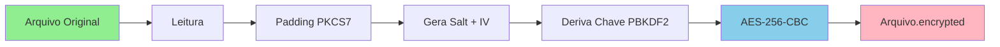

# Simple AES Encryptor 🔐

<div align="center">


**Simple GUI app for file encryption using AES-256-GCM & Serpent**

[](https://opensource.org/licenses/MIT)
[](https://www.python.org/downloads/)
[](https://www.debian.org/)

[Instalação](#-instalação) • [Uso](#-uso) • [Recursos](#-recursos) • [Documentação](#-documentação)

</div>

---

## 📋 Sobre

**Simple Encryptor GCM** is a GUI application developed in Python to encrypt and decrypt files using **AES-256-GCM** and **Serpent-256**. The key feature is the **real-time education monitor** that visually shows the encryption process step-by-step (e.g. Matrix Mixing, S-Boxes) while maintaining high performance via C extensions.

### ✨ Recursos

- 🔐 **Multi-Algorithm**: AES-256-GCM (Standard) & Serpent-256 (High Security)
- 🚀 **Turbo Performance**: Custom C backend (`libserpent`) for Serpent acceleration
- 🔑 **PBKDF2**: Key derivation with HMAC-SHA256
- 🎨 **Interface Moderna**: CustomTkinter com tema Dark/Matrix
- 👁️ **Deep Vision**: Inspection of internal rounds (AES MixColumns, Serpent S-Boxes)
- 📟 **Real-Time Monitor**: Visual terminal showing the crypto math live via sampling
- 📦 **Pacote Debian**: Fácil instalação via `.deb`
- 🎯 **Desktop Integration**: Drag & Drop support, Native File Dialogs
- 🔒 **Authenticated Encryption**: GCM (AES) and CTR+HMAC (Serpent) ensure integrity

## 🚀 Instalação

### Método 1: Via Pacote .deb (Recomendado)

```bash
# Instale o pacote
sudo dpkg -i simple-encryptor.deb

# Se houver dependências faltando:
sudo apt-get install -f
```

### Método 2: Execução Direta

```bash
# Clone o repositório
git clone https://github.com/seu-usuario/simple-aes-encryptor.git
cd simple-aes-encryptor

# Instale as dependências
sudo apt-get install python3-tk python3-cryptography
pip3 install customtkinter --break-system-packages

# Execute
python3 simple-encryptor/usr/bin/simple-encryptor
```

## 💻 Uso

### Iniciar o Aplicativo

**Via Terminal:**
```bash
simple-encryptor
```

**Via Menu:** Procure por "Simple AES Encryptor" no menu de aplicações (Utilidades → Segurança)

### Criptografar um Arquivo

1. Clique em **"Selecionar Arquivo"**
2. Escolha o arquivo desejado
3. Digite uma **senha forte**
4. Clique em **"🔐 Criptografar"**
5. Observe o monitor mostrando o processo em tempo real
6. Arquivo será salvo como `[nome-original].encrypted`

### Descriptografar um Arquivo

1. Selecione o arquivo `.encrypted`
2. Digite a **mesma senha** usada na criptografia
3. Clique em **"🔓 Descriptografar"**
4. Arquivo original será restaurado

## 🔧 Como Funciona

### Processo de Criptografia



### Estrutura do Arquivo Criptografado

```
+----------------+----------------+------------------------+
|   Salt (16B)   |    IV (16B)    |   Dados Criptografados |
+----------------+----------------+------------------------+
```

### Technical Specifications

- **Algorithms**: 
    - AES-256 (GCM Mode)
    - Serpent-256 (CTR Mode + HMAC-SHA256)
- **Key Size**: 256 bits (32 bytes)
- **KDF**: PBKDF2-HMAC-SHA256 (100,000 iterations)
- **Integrity**: GCM Tag (16 bytes) or HMAC-SHA256 Tag (16 bytes)
- **Salt/IV**: Randomly generated per file (Secrets module)
- **Backend**: 
    - AES: OpenSSL (via `cryptography`)
    - Serpent: Custom C Extension (`libserpent.so`) + Pure Python Fallback

## 📁 Estrutura do Projeto

```
simple-aes-encryptor/
├── simple-encryptor/           # Estrutura do pacote Debian
│   ├── DEBIAN/
│   │   └── control             # Metadados do pacote
│   └── usr/
│       ├── bin/
│       │   └── simple-encryptor  # Executável principal
│       └── share/
│           ├── applications/
│           │   └── simple-encryptor.desktop
│           └── icons/
│               └── simple-encryptor.png
├── docs/                       # Documentação
│   ├── ARCHITECTURE.md         # Arquitetura técnica
│   ├── SECURITY.md            # Considerações de segurança
│   └── images/                # Imagens e screenshots
├── README.md                  # Este arquivo
├── LICENSE                    # Licença MIT
├── CONTRIBUTING.md            # Guia de contribuição
└── .gitignore                # Arquivos ignorados
```

## 🎨 Screenshots

### Interface Principal
*[Screenshot da interface principal]*

### Monitor de Criptografia
O terminal visual mostra em tempo real:
- Salt e IV gerados
- Chave derivada
- Progresso chunk-por-chunk
- Hexdump dos dados criptografados

```
======================================================================
INICIANDO CRIPTOGRAFIA AES-256-CBC
======================================================================
→ Gerando salt: a1b2c3d4e5f6g7h8i9j0k1l2m3n4o5p6
→ Gerando IV:   f1e2d3c4b5a69788990a1b2c3d4e5f6
→ Derivando chave PBKDF2 (100,000 iterações)...
→ Chave derivada: 1234567890abcdef1234567890abcdef1234567890abcdef...

→ CRIPTOGRAFANDO DADOS...
  [ 10.0%] Chunk   1/ 10: a1b2c3d4e5f6789012345678901234567890abcdef...
  [ 20.0%] Chunk   2/ 10: f6e7d8c9b0a1928374650fabcdef0123456789ab...
```

## 🛡️ Segurança

> [!IMPORTANT]
> Este aplicativo usa criptografia forte (AES-256), mas a segurança depende da **força da sua senha**.

### Boas Práticas

✅ Use senhas longas (mínimo 12 caracteres)  
✅ Combine letras maiúsculas, minúsculas, números e símbolos  
✅ Nunca compartilhe suas senhas  
✅ Guarde senhas em um gerenciador de senhas  
⚠️ **Se esquecer a senha, o arquivo NÃO pode ser recuperado!**

### Limitações

- ❌ Não protege contra keyloggers
- ❌ Não protege contra acesso físico ao sistema
- ❌ Não inclui autenticação de dois fatores

Para mais detalhes, consulte [SECURITY.md](docs/SECURITY.md)

## 📚 Documentação

- [Arquitetura Técnica](docs/ARCHITECTURE.md) - Detalhes da implementação
- [Guia de Segurança](docs/SECURITY.md) - Considerações de segurança
- [Guia de Contribuição](CONTRIBUTING.md) - Como contribuir

## 🤝 Contribuindo

Contribuições são bem-vindas! Por favor, leia [CONTRIBUTING.md](CONTRIBUTING.md) para detalhes sobre o processo.

### Desenvolvimento

```bash
# Clone o repositório
git clone https://github.com/seu-usuario/simple-aes-encryptor.git
cd simple-aes-encryptor

# Instale dependências de desenvolvimento
sudo apt-get install python3-tk python3-cryptography

# Faça suas alterações

# Reconstrua o pacote
dpkg-deb --build simple-encryptor

# Teste
sudo dpkg -i simple-encryptor.deb
simple-encryptor
```

## 📄 Licença

Este projeto está licenciado sob a Licença MIT - veja o arquivo [LICENSE](LICENSE) para detalhes.

## 🙏 Agradecimentos

- [Python Cryptography](https://cryptography.io/) - Biblioteca de criptografia
- [Tkinter](https://docs.python.org/3/library/tkinter.html) - Framework GUI
- Icon made by [Pixel perfect](https://www.flaticon.com/authors/pixel-perfect) from [www.flaticon.com](https://www.flaticon.com/)

## 📞 Suporte

- 🐛 **Issues**: [GitHub Issues](https://github.com/seu-usuario/simple-aes-encryptor/issues)
- 💬 **Discussões**: [GitHub Discussions](https://github.com/seu-usuario/simple-aes-encryptor/discussions)

## 🗺️ Roadmap

- [ ] Criptografia de múltiplos arquivos
- [ ] Compressão antes da criptografia
- [ ] Interface em outros idiomas
- [ ] Tema claro/escuro
- [ ] Criptografia de pastas inteiras

---

<div align="center">

**Desenvolvido com ❤️ usando Python**

[⬆ Voltar ao topo](#simple-aes-encryptor-)

</div>
