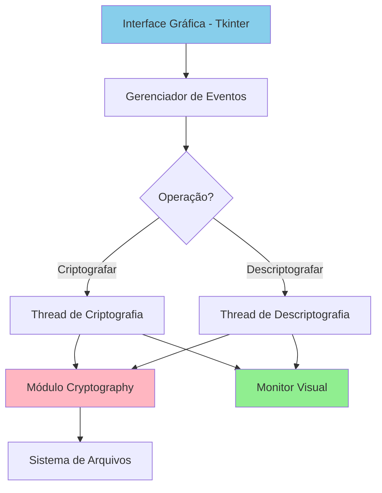
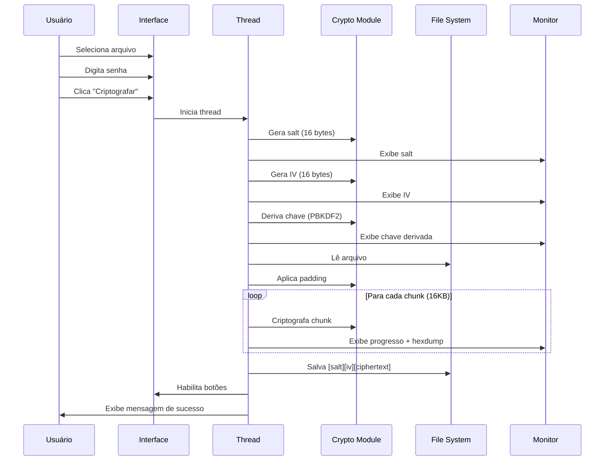
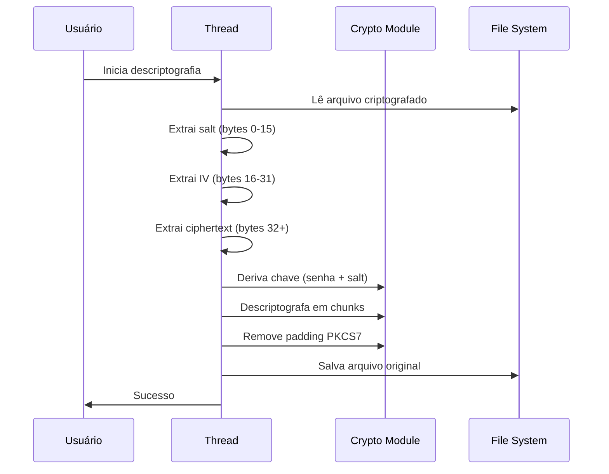

# Arquitetura Técnica - Simple AES Encryptor

## 📐 Visão Geral

O Simple AES Encryptor é uma aplicação desktop Python que implementa criptografia AES-256 com interface gráfica usando Tkinter.

## 🏗️ Componentes Principais



## 🔧 Módulos e Responsabilidades

### 1. Interface do Usuário (`ModernEncryptorApp`)

**Componentes:**
- **CustomTkinter**: Framework moderno baseado em Tkinter para visual Material Design.
- **Zenity/Kdialog**: Diálogos nativos do sistema para seleção de arquivos.
- **Deep Vision**: Checkbox para ativar/desativar visualização detalhada.

**Tecnologia:** `customtkinter`, `subprocess` (para diálogos nativos)

### 2. Gerenciamento de Threads

**Por que threads?**
- Evita congelamento da UI durante operações longas
- Permite atualização em tempo real do monitor visual

```python
thread = threading.Thread(target=self._encrypt_file_thread)
thread.daemon = True
thread.start()
```

### 3. Motor de Criptografia

#### Derivação de Chave (PBKDF2)

```python
def _derive_key(password: str, salt: bytes) -> bytes:
    kdf = PBKDF2HMAC(
        algorithm=hashes.SHA256(),
        length=32,          # 256 bits
        salt=salt,
        iterations=100000,   # Protege contra brute-force
        backend=default_backend()
    )
    return kdf.derive(password.encode())
```

**Por que PBKDF2?**
- Deriva chaves fortes de senhas fracas
- Iterations altas protegem contra ataques de dicionário
- Padrão NIST recomendado

#### Criptografia AES-256-CBC

```python
cipher = Cipher(
    algorithms.AES(key),    # 256-bit key
    modes.CBC(iv),          # Cipher Block Chaining
    backend=default_backend()
)
encryptor = cipher.encryptor()
ciphertext = encryptor.update(padded_data) + encryptor.finalize()
```

**Características:**
- **AES-256**: 256 bits de chave (2^256 possibilidades)
- **CBC Mode**: Cada bloco depende do anterior
- **IV único**: Garante que mesmo arquivos idênticos geram ciphertexts diferentes

### 4. Padding (PKCS7)

```python
padder = padding.PKCS7(128).padder()
padded_data = padder.update(plaintext) + padder.finalize()
```

**Por que padding?**
- AES opera em blocos de 128 bits (16 bytes)
- Arquivos nem sempre têm tamanho múltiplo de 16
- PKCS7 adiciona bytes necessários para completar o último bloco

### 5. Motor de Visualização (`AESVisualizer`)

O visualizador roda em paralelo à criptografia real. Ele não processa o arquivo inteiro (o que seria lento), mas sim "amostras" (chunks) em tempo real, aplicando a matemática exata do AES em Python puro para fins educativos.

**Funcionalidades:**
- **Forward AES**: `SubBytes` -> `ShiftRows` -> `MixColumns`
- **Inverse AES**: `InvSubBytes` -> `InvShiftRows` -> `InvMixColumns` (Matemática Reversa)
- **Round Keys**: Visualização da aplicação de chaves de rodada (0-14).
- **Throttling**: Limita a atualização visual a 1Hz para não gargalar a CPU durante criptografias pesadas.

```python
def visualize_decrypt_block(self, block):
    # ...
    self.log_callback("> InvMixColumns", 'data')
    state = self._inv_mix_columns(state)
    # ...
```

## 🔐 Fluxo de Criptografia Detalhado



## 📊 Formato do Arquivo Criptografado

```
Offset | Size | Descrição
-------|------|----------
0      | 16B  | Salt (PBKDF2)
16     | 16B  | IV (AES-CBC)
32     | N    | Ciphertext (dados criptografados + padding)
```

**Exemplo:**
```
00000000: a1b2 c3d4 e5f6 0788 1920 a1b2 c3d4 e5f6  <- Salt
00000010: f1e2 d3c4 b5a6 9788 990a 1b2c 3d4e 5f6a  <- IV
00000020: 1234 5678 90ab cdef 1234 5678 90ab cdef  <- Ciphertext...
```

## 🔓 Fluxo de Descriptografia



## 🧮 Segurança Computacional

### Força da Chave

- **AES-256**: 2^256 ≈ 1.15 × 10^77 possibilidades
- **Tempo estimado para quebrar** (assumindo 1 trilhão de tentativas/segundo):
  - ~10^63 anos (idade do universo: ~10^10 anos)

### PBKDF2 - Proteção contra Brute Force

```
Tempo por tentativa = 100,000 iterações × tempo(SHA256)
```

**Exemplo:**
- SHA256: ~1 µs
- PBKDF2: ~100 ms
- **10,000x mais lento** para atacante

### Salt e IV

**Salt:**
- Único por arquivo
- Impede ataques de rainbow table
- Pode ser armazenado em plaintext

**IV:**
- Único por arquivo
- Garante que arquivos idênticos → ciphertexts diferentes
- Pode ser armazenado em plaintext

## 📦 Estrutura de Classes

```python
class EncryptorApp:
    """Aplicação principal"""
    
    # Atributos
    root: tk.Tk                    # Janela principal
    selected_file: str             # Arquivo selecionado
    is_processing: bool            # Flag de processamento
    terminal: tk.Text              # Widget do monitor
    
    # Métodos Públicos
    __init__(root)                 # Inicialização
    
    # Métodos Privados - UI
    _setup_ui()                    # Configura interface
    _select_file()                 # Dialog de seleção
    _toggle_password()             # Mostra/esconde senha
    _log_terminal(message)         # Log no monitor
    
    # Métodos Privados - Crypto
    _derive_key(password, salt)    # PBKDF2
    _encrypt_file()                # Wrapper thread
    _encrypt_file_thread()         # Criptografia real
    _decrypt_file()                # Wrapper thread
    _decrypt_file_thread()         # Descriptografia real
```

## ⚡ Performance

### Processamento em Chunks

**Tamanho do chunk: 16 KB**

**Por que 16 KB?**
- ✅ Equilíbrio memória/velocidade
- ✅ Permite feedback visual frequente
- ✅ Funciona bem com AES (múltiplo de 16 bytes)

**Performance estimada:**
```
Arquivo 100 MB:
- Chunks: ~6,400
- Tempo: ~2-5 segundos (SSD)
- Uso de RAM: ~16 KB (constante)
```

### Delay Visual

```python
time.sleep(0.01)  # 10ms entre chunks
```

**Trade-off:**
- ⚠️ Adiciona overhead de ~64ms para arquivo de 100MB
- ✅ Permite visualização suave do processo
- ✅ Não afeta significativamente arquivos pequenos

## 🐛 Tratamento de Erros

```python
try:
    # Operação de crypto
except Exception as e:
    self._log_terminal(f"\n✗ ERRO: {str(e)}\n")
    messagebox.showerror("Erro", f"Erro: {str(e)}")
finally:
    self.is_processing = False
    self.encrypt_btn.config(state=tk.NORMAL)
```

**Erros comuns tratados:**
- ❌ Arquivo não encontrado
- ❌ Permissões insuficientes
- ❌ Senha incorreta (descriptografia)
- ❌ Arquivo corrompido
- ❌ Espaço em disco insuficiente

## 🔮 Possíveis Melhorias

### Performance
- [ ] Usar `multiprocessing` para arquivos muito grandes
- [ ] Implementar cache de chaves derivadas
- [ ] Otimizar tamanho de chunks dinamicamente

### Segurança
- [ ] Adicionar HMAC para autenticação
- [ ] Implementar secure file deletion
- [ ] Adicionar verificador de força de senha
- [ ] Usar GCM em vez de CBC+HMAC

### Funcionalidades
- [ ] Compressão antes da criptografia (zlib)
- [ ] Suporte a múltiplos arquivos (batch)
- [ ] Progress bar gráfica além do terminal
- [ ] Histórico de arquivos processados

---

**Última atualização:** 2026-02-06
